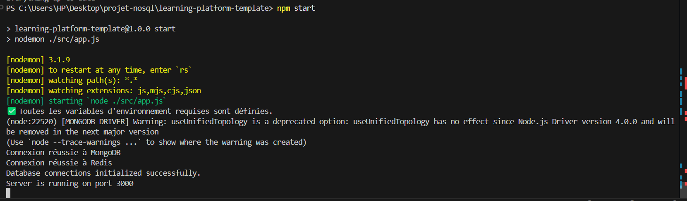

# Projet de fin de module NoSQL
# QUESTION/REPONSES:
 # config/db.js
 
  1.question :
  Pourquoi créer un module séparé pour les connexions aux bases de données ?

   reponse :
  -Un module séparé rend ton code plus propre, sécurisé et facile à maintenir
  -avec cette methode on a la gestion des erreurs facilement 
  -Isoler la connexion facilite l'écriture de tests unitaires et de tests d'intégration.
   On peut simuler la base de données sans affecter le reste du code...

   2.question :
 Comment gérer proprement la fermeture des connexions ?
    reponse:
 our gérer proprement la fermeture des connexions, il est recommandé d'utiliser des gestionnaires d'événements comme 
`process.on('SIGINT')` pour détecter l'arrêt de l'application et fermer les connexions de manière contrôlée. 
MongoDB propose la méthode `close()` et Redis la méthode `quit()` pour libérer les ressources. 
 Un bloc `try...catch...finally` peut également être utilisé pour s'assurer que les connexions sont fermées même en cas d'erreur.

# config/env.js
  1. Question: 
 Pourquoi est-il important de valider les variables d'environnement au démarrage ?
  Réponse : 
  -Pour garantir que l'application démarre avec toutes les configurations essentielles, réduisant ainsi les risques de dysfonctionnements et facilitant le diagnostic des erreurs dès le lancement.

2.Question: Que se passe-t-il si une variable requise est manquante ?
- Réponse : 
 L'application doit cesser son exécution immédiatement avec un message d'erreur clair, afin de prévenir des erreurs inattendues et de signaler précisément le problème.

 # controllers/courseController.js
   
   
  1. Question: Quelle est la différence entre un contrôleur et une route ?
 
  Réponse:
     -Une route spécifie l'URL et la méthode HTTP (comme GET ou POST) à utiliser, tandis qu'un contrôleur contient le code qui gère la logique de traitement lorsque cette route est appelée.

  2.Question : Pourquoi séparer la logique métier des routes ?
   Réponse :
  -Séparer la logique métier des routes permet de rendre le code plus clair, mieux organisé et plus facile à maintenir. Cela simplifie également la création de tests unitaires, car la logique peut être testée de 
    manière indépendante des routes.

  # routes/courseRoutes.js

   1 . Question: Pourquoi séparer les routes dans différents fichiers ?

    Réponse : 
       
  Séparer les routes dans plusieurs fichiers permet de mieux organiser le code, le rendant plus clair et plus facile à gérer, surtout dans les projets de grande taille avec de nombreux points d'accès.

 2.Question : Comment organiser les routes de manière cohérente ?
 

  => Réponse:
      Il est recommandé de regrouper les routes par fonctionnalité ou domaine spécifique (par exemple, userRoutes.js pour la gestion des utilisateurs) afin de maintenir une structure logique et compréhensible du projet.

   # service/mongoService.js
   1. Question: Pourquoi créer des services séparés ?

   Réponse: 
  Créer des services séparés permet de centraliser la logique métier, favorisant ainsi sa réutilisation et réduisant la répétition de code dans les contrôleurs. 

   # service/redisService.js
  1.Question : Comment gérer efficacement le cache avec Redis ?
        Réponse :
        Il est essentiel de définir des clés avec des durées de vie limitées (TTL) et de mettre à jour ou supprimer les données obsolètes pour maintenir un cache optimal.
   2.Question: Quelles sont les bonnes pratiques pour les clés Redis ?
       Réponse :
       Il est recommandé d'utiliser des noms de clés explicites et de prévenir les conflits en ajoutant des préfixes (par exemple, courses:) pour mieux organiser les données.
   # app.js    
      
   1. Question: Comment organiser le point d'entrée de l'application ?
       reponse:
        Il est important d'initialiser les connexions aux services externes, configurer les middlewares nécessaires et ensuite définir les routes pour structurer le processus de démarrage de l'application.
   
  2. Question: Quelle est la meilleure façon de gérer le démarrage de l'application ?
       reponse:
          La gestion du démarrage de l'application doit inclure des blocs try-catch pour capturer et traiter les erreurs éventuelles, assurant ainsi une gestion appropriée des échecs dès le lancement.
  # env.
   1. Question: Quelles sont les informations sensibles à ne jamais commiter ?
       => Réponse :
    Il est crucial de ne jamais inclure dans un dépôt Git des éléments tels que des mots de passe, des clés API, des certificats, des informations personnelles ou des configurations sensibles. Utilisez un fichier .gitignore et des outils de gestion des secrets pour protéger ces données.    
    
2. Question: Pourquoi utiliser des variables d'environnement ?
      => Réponse : 
      Les variables d'environnement permettent de stocker des informations sensibles et des paramètres spécifiques à chaque environnement, sans les intégrer directement dans le code. Cela renforce la sécurité, la portabilité et la flexibilité des applications, en permettant de modifier ces valeurs sans toucher au code source.

   ---START RUNING APPLICATION-----------
   using npm start
   

     

